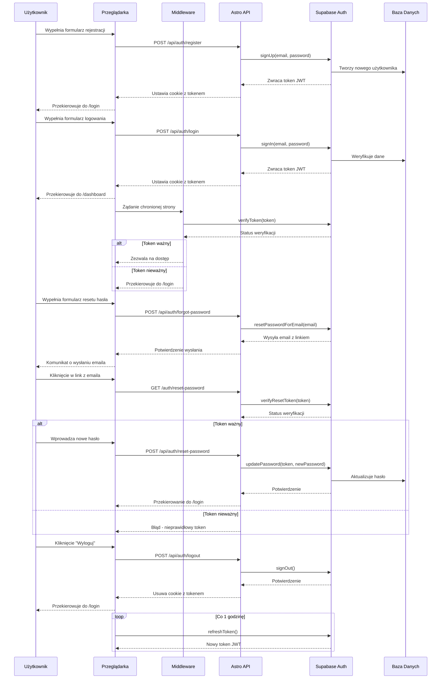

```mermaid
sequenceDiagram
    participant U as Użytkownik
    participant P as Przeglądarka
    participant M as Middleware
    participant A as Astro API
    participant S as Supabase Auth
    participant DB as Baza Danych

    %% Rejestracja
    U->>P: Wypełnia formularz rejestracji
    P->>A: POST /api/auth/register
    A->>S: signUp(email, password)
    S->>DB: Tworzy nowego użytkownika
    S-->>A: Zwraca token JWT
    A-->>P: Ustawia cookie z tokenem
    P-->>U: Przekierowuje do /login

    %% Logowanie
    U->>P: Wypełnia formularz logowania
    P->>A: POST /api/auth/login
    A->>S: signIn(email, password)
    S->>DB: Weryfikuje dane
    S-->>A: Zwraca token JWT
    A-->>P: Ustawia cookie z tokenem
    P-->>U: Przekierowuje do /dashboard

    %% Weryfikacja sesji
    P->>M: Żądanie chronionej strony
    M->>S: verifyToken(token)
    S-->>M: Status weryfikacji
    alt Token ważny
        M-->>P: Zezwala na dostęp
    else Token nieważny
        M-->>P: Przekierowuje do /login
    end

    %% Odzyskiwanie hasła
    U->>P: Wypełnia formularz resetu hasła
    P->>A: POST /api/auth/forgot-password
    A->>S: resetPasswordForEmail(email)
    S-->>A: Wysyła email z linkiem
    A-->>P: Potwierdzenie wysłania
    P-->>U: Komunikat o wysłaniu emaila

    %% Reset hasła
    U->>P: Kliknięcie w link z emaila
    P->>A: GET /auth/reset-password
    A->>S: verifyResetToken(token)
    S-->>A: Status weryfikacji
    alt Token ważny
        U->>P: Wprowadza nowe hasło
        P->>A: POST /api/auth/reset-password
        A->>S: updatePassword(token, newPassword)
        S->>DB: Aktualizuje hasło
        S-->>A: Potwierdzenie
        A-->>P: Przekierowanie do /login
    else Token nieważny
        A-->>P: Błąd - nieprawidłowy token
    end

    %% Wylogowanie
    U->>P: Kliknięcie "Wyloguj"
    P->>A: POST /api/auth/logout
    A->>S: signOut()
    S-->>A: Potwierdzenie
    A-->>P: Usuwa cookie z tokenem
    P-->>U: Przekierowuje do /login

    %% Odświeżanie tokenu
    loop Co 1 godzinę
        P->>S: refreshToken()
        S-->>P: Nowy token JWT
    end
```
