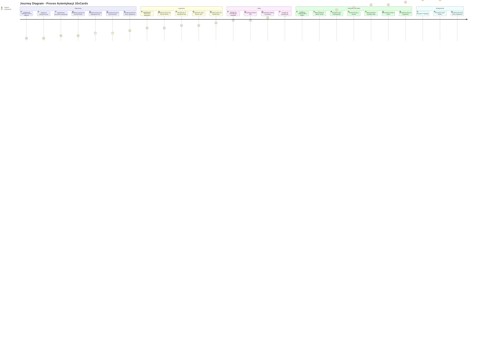

```mermaid
journey
    title Journey Diagram - Proces Autentykacji 10xCards

    section Rejestracja
        Użytkownik odwiedza stronę główną: 1: Użytkownik
        Kliknięcie "Zarejestruj się": 1: Użytkownik
        Wypełnienie formularza rejestracji: 2: Użytkownik
        Walidacja danych po stronie klienta: 2: System
        Wysłanie danych do Supabase Auth: 3: System
        Utworzenie konta w bazie danych: 3: System
        Przekierowanie do strony logowania: 4: System

    section Logowanie
        Wypełnienie formularza logowania: 5: Użytkownik
        Walidacja danych po stronie klienta: 5: System
        Weryfikacja w Supabase Auth: 6: System
        Ustawienie sesji i tokena JWT: 6: System
        Przekierowanie do dashboardu: 7: System

    section Sesja
        Dostęp do chronionych zasobów: 8: Użytkownik
        Weryfikacja tokena JWT: 8: System
        Odświeżanie tokena co godzinę: 9: System
        Dostęp do dashboardu: 10: Użytkownik

    section Odzyskiwanie hasła
        Kliknięcie "Zapomniałem hasła": 11: Użytkownik
        Wprowadzenie adresu email: 11: Użytkownik
        Wysłanie linku resetującego: 12: System
        Otwarcie linku z emaila: 13: Użytkownik
        Wprowadzenie nowego hasła: 14: Użytkownik
        Aktualizacja hasła w bazie: 14: System
        Przekierowanie do logowania: 15: System

    section Wylogowanie
        Kliknięcie "Wyloguj": 16: Użytkownik
        Usunięcie sesji i tokena: 16: System
        Przekierowanie do strony logowania: 17: System
``` 