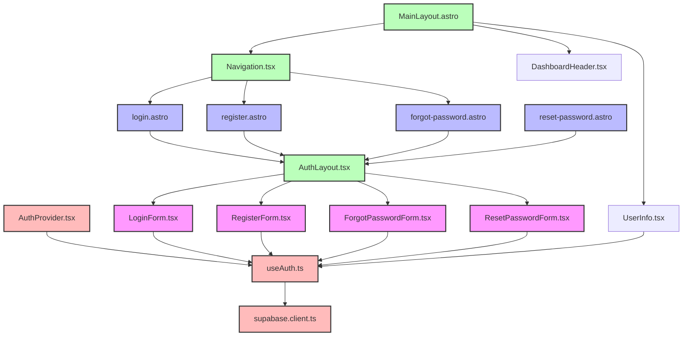

```mermaid
graph TD
    %% Main Layout Components
    MainLayout[MainLayout.astro]
    AuthLayout[AuthLayout.tsx]
    Navigation[Navigation.tsx]
    UserInfo[UserInfo.tsx]
    DashboardHeader[DashboardHeader.tsx]

    %% Auth Pages
    LoginPage[login.astro]
    RegisterPage[register.astro]
    ForgotPasswordPage[forgot-password.astro]
    ResetPasswordPage[reset-password.astro]

    %% Auth Forms
    LoginForm[LoginForm.tsx]
    RegisterForm[RegisterForm.tsx]
    ForgotPasswordForm[ForgotPasswordForm.tsx]
    ResetPasswordForm[ResetPasswordForm.tsx]

    %% Auth Provider and Hooks
    AuthProvider[AuthProvider.tsx]
    UseAuth[useAuth.ts]
    SupabaseClient[supabase.client.ts]

    %% Layout Structure
    MainLayout --> Navigation
    MainLayout --> UserInfo
    MainLayout --> DashboardHeader
    AuthLayout --> LoginForm
    AuthLayout --> RegisterForm
    AuthLayout --> ForgotPasswordForm
    AuthLayout --> ResetPasswordForm

    %% Page Structure
    LoginPage --> AuthLayout
    RegisterPage --> AuthLayout
    ForgotPasswordPage --> AuthLayout
    ResetPasswordPage --> AuthLayout

    %% Auth Flow
    AuthProvider --> UseAuth
    UseAuth --> SupabaseClient
    LoginForm --> UseAuth
    RegisterForm --> UseAuth
    ForgotPasswordForm --> UseAuth
    ResetPasswordForm --> UseAuth

    %% Navigation Flow
    Navigation --> LoginPage
    Navigation --> RegisterPage
    Navigation --> ForgotPasswordPage
    UserInfo --> UseAuth

    %% Styling
    classDef authComponent fill:#f9f,stroke:#333,stroke-width:2px
    classDef page fill:#bbf,stroke:#333,stroke-width:2px
    classDef layout fill:#bfb,stroke:#333,stroke-width:2px
    classDef provider fill:#fbb,stroke:#333,stroke-width:2px

    class LoginForm,RegisterForm,ForgotPasswordForm,ResetPasswordForm authComponent
    class LoginPage,RegisterPage,ForgotPasswordPage,ResetPasswordPage page
    class MainLayout,AuthLayout,Navigation layout
    class AuthProvider,UseAuth,SupabaseClient provider
``` 